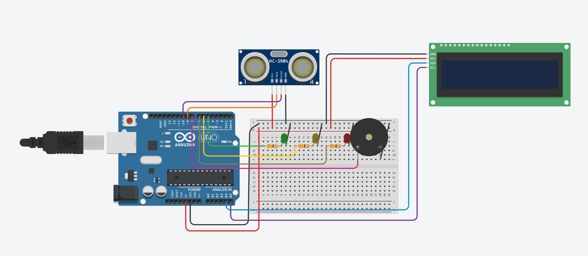

# Ultrasonic Parking Sensor – HC-SR04



## Overview
This project is an ultrasonic parking sensor built with an HC-SR04 sensor and Arduino.  
It measures the distance to objects and displays the value on an LCD screen in real time.  
Additionally, the measurements are logged in CSV format via the serial port for analysis.

## Features
- **Distance Measurement:** Accurate readings using HC-SR04 ultrasonic sensor.
- **LCD Output:** Real-time distance displayed on a 16x20 LCD.
- **CSV Logging:** Distance (cm) and echo time (µs) are exported in CSV format.
- **Compact Design:** Minimal wiring suitable for educational or prototype purposes.

## Hardware
- Arduino Uno or compatible board
- HC-SR04 Ultrasonic Sensor
- 16x2 LCD display
- Jumper wires
- Breadboard (optional)

## Software
- Arduino IDE (C++)
- Uses `pulseIn()` to measure echo duration
- Distance calculation:
  ```cpp
  distance_cm = (duration / 2.0) / 29.1;
  ultrasonic-parking-sensor/


